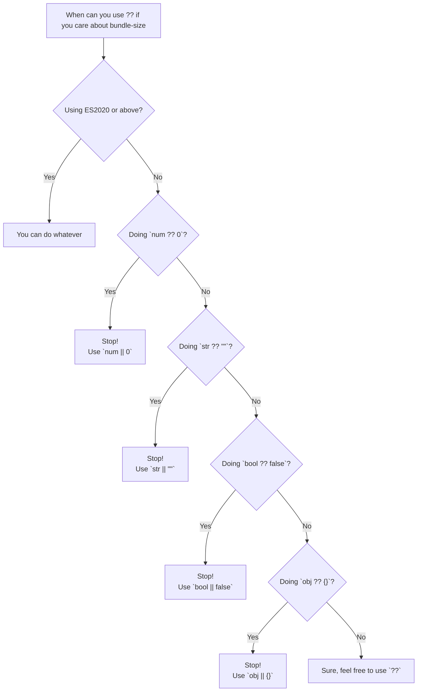

```mermaid
graph TB
    A["When can you use ?? if you care about bundle-size"] --> B{"Using ES2020 or above?"};
    B -->|Yes| C["You can do whatever"];
    B -->|No| D{"Doing `num ?? 0`?"};
    D -->|Yes| E["Stop!\n Use `num || 0`"];
    D -->|No| F{"Doing `str ?? &quot;&quot;`?"};
    F -->|Yes| G["Stop!\n Use `str || &quot;&quot;`"];
    F -->|No| H{"Doing `bool ?? false`?"};
    H -->|Yes| I["Stop!\n Use `bool || false`"];
    H -->|No| J{"Doing `obj ?? {}`?"};
    J -->|Yes| L["Stop!\n Use `obj || {}`"];
    J -->|No| K["Sure, feel free to use `??`"];
```

https://gist.github.com/guilhermesimoes/586a96cc6700a962b2fb58bd5bc600b1
